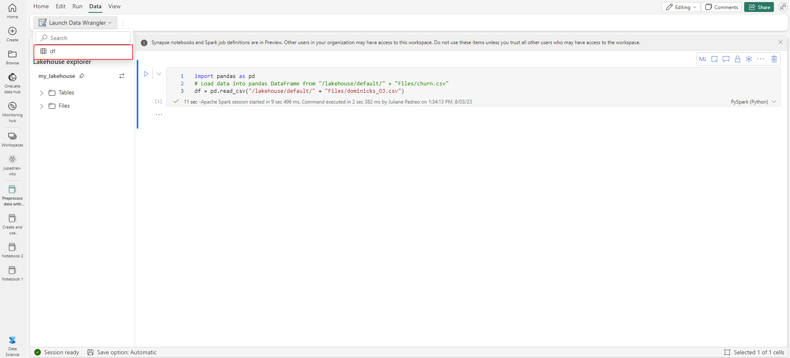
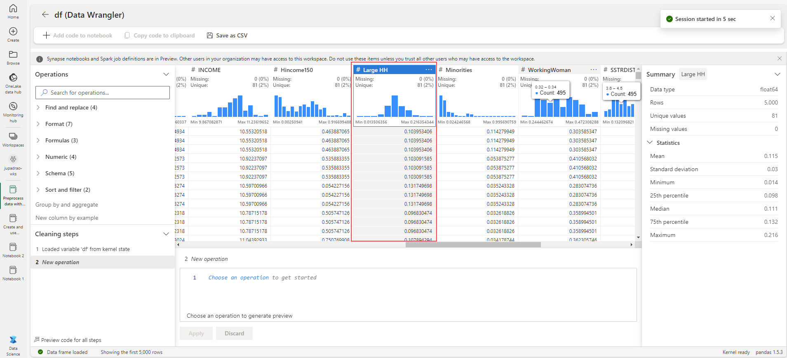

---
lab:
  title: "Procesamiento previo de datos con Data Wrangler en Microsoft\_Fabric"
  module: Preprocess data with Data Wrangler in Microsoft Fabric
---

# Uso de cuadernos para entrenar un modelo en Microsoft Fabric

En este laboratorio, aprenderá a usar Data Wrangler en Microsoft Fabric para procesar previamente datos y generar código mediante una biblioteca de operaciones comunes de ciencia de datos.

Este laboratorio se tarda aproximadamente **30** minutos en completarse.

> **Nota**: Necesitará una licencia de Microsoft Fabric para realizar este ejercicio. Consulte [Introducción a Microsoft Fabric](https://learn.microsoft.com/fabric/get-started/fabric-trial) para obtener más información sobre cómo habilitar una licencia de evaluación de Fabric gratuita. Para hacerlo, necesitará una cuenta *profesional* o *educativa* de Microsoft. Si no tiene una, puede [registrarse para obtener una evaluación gratuita de Microsoft Office 365 E3 o superior](https://www.microsoft.com/microsoft-365/business/compare-more-office-365-for-business-plans).

## Crear un área de trabajo

Antes de trabajar con datos de Fabric, cree un área de trabajo con la evaluación gratuita de Fabric habilitada.

1. Inicie sesión en [Microsoft Fabric](https://app.fabric.microsoft.com) en `https://app.fabric.microsoft.com` y seleccione **Power BI**.
2. En la barra de menús de la izquierda, seleccione **Áreas de trabajo** (el icono tiene un aspecto similar a &#128455;).
3. Cree una nueva área de trabajo con el nombre que prefiera y seleccione un modo de licencia que incluya capacidad de Fabric (*Evaluación gratuita*, *Prémium* o *Fabric*).
4. Cuando se abra la nueva área de trabajo, estará vacía, como se muestra aquí:

    

## Creación de un almacén de lago y carga de archivos

Ahora que tiene un área de trabajo, es el momento de cambiar a la experiencia *Ciencia de datos* en el portal y crear un almacén de lago de datos para los archivos de datos que va a analizar.

1. En la parte inferior izquierda del portal de Power BI, seleccione el icono de **Power BI** y cambie a la experiencia **Ingeniería de datos**.
1. En la página principal de **Ingeniería de datos**, cree un nuevo **almacén de lago** con el nombre que prefiera.

    Al cabo de un minuto más o menos, se creará un nuevo almacén de lago sin **tablas** ni **archivos**. Debe ingerir algunos datos en el almacén de lago de datos para su análisis. Hay varias maneras de hacerlo, pero en este ejercicio simplemente descargará y extraerá una carpeta de archivos de texto del equipo local (o máquina virtual de laboratorio si procede) y, luego, los cargará en el almacén de lago.

1. TAREA PENDIENTE: Descargue y guarde el archivo CSV `dominicks_OJ.csv` para este ejercicio desde [https://raw.githubusercontent.com/MicrosoftLearning/dp-data/main/XXXXX.csv](https://raw.githubusercontent.com/MicrosoftLearning/dp-data/main/XXXXX.csv).


1. Vuelva a la pestaña del explorador web que contiene el almacén de lago y, en el menú **...** del nodo **Archivos** en el panel **Vista de lago**, seleccione **Cargar** y **Cargar archivos** y, luego, cargue el archivo **dominicks_OJ.csv** del equipo local (o la máquina virtual de laboratorio si procede) en el almacén de lago.
6. Una vez cargados los archivos, expanda **Archivos** y compruebe que se ha cargado el archivo CSV.

## Creación de un cuaderno

Para entrenar un modelo, puede crear un *cuaderno*. Los cuadernos proporcionan un entorno interactivo en el que puede escribir y ejecutar código (en varios lenguajes) como *experimentos*.

1. En la parte inferior izquierda del portal de Power BI, seleccione el icono **Ingeniería de datos** y cambie a la experiencia **Ciencia de datos**.

1. En la página principal de **Ciencia de datos**, cree un nuevo **cuaderno**.

    Al cabo de unos segundos, se abrirá un nuevo cuaderno que contiene una sola *celda*. Los cuadernos se componen de una o varias celdas que pueden contener *código* o *Markdown* (texto con formato).

1. Seleccione la primera celda (que actualmente es una celda de *código* ) y, luego, en la barra de herramientas dinámica de su parte superior derecha, use el botón **M&#8595;** para convertir la celda en una celda de *Markdown*.

    Cuando la celda cambie a una celda de Markdown, se representará el texto que contiene.

1. Use el botón **&#128393;** (Editar) para cambiar la celda al modo de edición y, luego, elimine el contenido y escriba el texto siguiente:

    ```text
   # Train a machine learning model and track with MLflow

   Use the code in this notebook to train and track models.
    ``` 

## Carga de datos en un objeto DataFrame

Ahora está listo para ejecutar código para preparar los datos y entrenar un modelo. Para trabajar con datos, usará objetos *DataFrame*. Los objetos DataFrame de Spark son similares a los de Pandas en Python y proporcionan una estructura común para trabajar con datos en filas y columnas.

1. En el panel **Agregar almacén de lago**, seleccione **Agregar** para agregar un almacén de lago.
1. Seleccione **Almacén de lago existente** y elija **Agregar**.
1. Seleccione el almacén de lago que creó en una sección anterior.
1. Expanda la carpeta **Archivos** para que el archivo CSV aparezca junto al editor de cuadernos.
1. En el menú **...** del archivo **churn.csv**, seleccione **Cargar datos** > **Pandas**. Se agregará al cuaderno una nueva celda de código que contiene el código siguiente:

    ```python
    import pandas as pd
    df = pd.read_csv("/lakehouse/default/" + "Files/dominicks_OJ.csv") 
    display(df.head(5))
    ```

    > **Sugerencia**: Puede ocultar el panel que contiene los archivos de la izquierda usando su icono **<<** . De esta forma, podrá centrarse en el cuaderno.

1. Use el botón **&#9655; Ejecutar celda** situado a la izquierda de la celda para ejecutarla.

    > **Nota**: Dado que esta es la primera vez que ha ejecutado código de Spark en esta sesión, se debe iniciar el grupo de Spark. Esto significa que la primera ejecución de la sesión puede tardar un minuto o así en completarse. Las ejecuciones posteriores serán más rápidas.

## Visualización de estadísticas de resumen

Cuando se inicia Data Wrangler, genera una descripción general descriptiva del dataframe en el panel Resumen. 

1. Seleccione **Datos** en el menú superior y, a continuación, la lista desplegable **Data Wrangler** para examinar el conjunto de datos `df`.

    

1. Seleccione la columna **HH grande** y observe con qué facilidad puede determinar la distribución de datos de esta característica.

    

    Tenga en cuenta que esta característica sigue una distribución normal.

1. Compruebe el panel lateral Resumen y observe los intervalos de percentil. 

    

    Puede ver que la mayoría de los datos se encuentran entre **0,098** y **0,132**, y que el 50 % de los valores de datos se encuentran dentro de ese intervalo.

## Aplicación de formato a los datos de texto

Ahora vamos a aplicar algunas transformaciones a la característica **Marca**.

1. En la página **Data Wrangler**, seleccione la característica `Brand`.

1. Vaya al panel **Operaciones**, expanda **Buscar y reemplazar** y, a continuación, seleccione **Buscar y reemplazar**.

1. En el panel **Buscar y reemplazar**, cambie las propiedades siguientes:
    
    - **Valor anterior** "."
    - **Nuevo valor:** " " (carácter de espacio)

    

    Puede ver los resultados de la operación en vista previa automática en la cuadrícula de presentación.

1. Seleccione **Aplicar**.

1. Vuelva al panel **Operaciones** y expanda **Formato**.

1. Seleccione **Convertir texto en mayúsculas**.

1. En el panel **Convertir texto en mayúsculas**, seleccione **Aplicar**.

1. Seleccione **Agregar código al cuaderno**. Además, también puede guardar el conjunto de datos transformado como un archivo .csv.

    Tenga en cuenta que el código se copia automáticamente en la celda del cuaderno y está listo para su uso.

1. Ejecute el código.

> **Importante:** El código generado no sobrescribe el dataframe original. 

Ha aprendido a generar código fácilmente y a manipular datos de texto mediante operaciones de Data Wrangler. 

## Aplicación de una transformación de codificador de acceso único

Ahora, vamos a generar el código para aplicar la transformación de codificador de acceso único como paso del procesamiento previo.

1. Seleccione **Datos** en el menú superior y, a continuación, la lista desplegable **Data Wrangler** para examinar el conjunto de datos `df`.

1. En el panel **Operaciones**, expanda **Fórmulas**.

1. Seleccione **Codificación de acceso único**.

1. En el panel **Codificación de acceso único**, seleccione **Aplicar**.

    Navegue hasta el final de la cuadrícula de visualización de Data Wrangler. Observe que se agregaron tres nuevas características y se quitó la característica `Brand`.

1. Seleccione **Agregar código al cuaderno**.

1. Ejecute el código.

## Operaciones de ordenación y filtrado

1. Seleccione **Datos** en el menú superior y, a continuación, la lista desplegable **Data Wrangler** para examinar el conjunto de datos `df`.

1. En el panel **Operaciones**, expanda **Ordenar y filtrar**.

1. Seleccione **Filtro**.

1. En el panel **Filtrar**, agregue la siguiente condición:
    
    - **Columna de destino:** Almacén
    - **Operación:** Igual a
    - **Valor:** 2

1. Seleccione **Aplicar**.

    Observe los cambios en la cuadrícula de visualización de Data Wrangler.

1. Vuelva al panel **Operaciones** y expanda **Ordenar y filtrar**.

1. Seleccione **Ordenar valores**.

1. En el panel **Precio**, agregue la siguiente condición:
    
    - **Nombre de columna:** Precio
    - **Criterio de ordenación:** Descendente

1. Seleccione **Aplicar**.

    Observe los cambios en la cuadrícula de visualización de Data Wrangler.

## Adición de datos

1. De vuelta en el panel **Operaciones**, seleccione **Agrupar por y agregar**.

1. En la propiedad **Columnas para agrupar por:** , seleccione la característica `Store`.

1. Seleccione **Agregar agregación**.

1. En la propiedad **Columna para agregar**, seleccione la característica `Quantity`.

1. Seleccione **Recuento** para la propiedad **Tipo de agregación**.

1. Seleccione **Aplicar**. 

    Observe los cambios en la cuadrícula de visualización de Data Wrangler.

## Examen y eliminación de pasos

Supongamos que ha cometido un error y necesita quitar la agregación que creó en el paso anterior. Siga estos pasos para quitarla:

1. Expanda el panel **Pasos de limpieza**.

1. Seleccione el paso **Agrupar por y agregar**.

1. Seleccione el icono de eliminación para quitarla.

    

    > **Importante:** La vista de cuadrícula y el resumen se limitan al paso actual.

    Observe que los cambios se revierten al paso anterior, que es el paso **Ordenar valores**.

1. Seleccione **Agregar código al cuaderno**.

1. Ejecute el código.

Ha generado el código para algunas de las operaciones de procesamiento previo y lo ha guardado en el cuaderno como una función, que luego puede reutilizar o modificar según sea necesario.

## Guardado del cuaderno y finalización de la sesión con Spark

Ahora que ha terminado el procesamiento previo de los datos para el modelado, puede guardar el cuaderno con un nombre descriptivo y finalizar la sesión con Spark.

1. En la barra de menús del cuaderno, use el icono ⚙️ **Configuración** para ver la configuración del cuaderno.
2. Establezca el **nombre** del cuaderno en **Procesamiento previo de datos con Data Wrangler** y, luego, cierre el panel de configuración.
3. En el menú del cuaderno, seleccione **Detener sesión** para finalizar la sesión con Spark.

## Limpieza de recursos

En este ejercicio, ha creado un cuaderno y ha usado Data Wrangler para explorar y procesar previamente los datos de un modelo de Machine Learning.

Si ha terminado de explorar los pasos de procesamiento previo, puede eliminar el área de trabajo que creó para este ejercicio.

1. En la barra de la izquierda, seleccione el icono del área de trabajo para ver todos los elementos que contiene.
2. En el menú **...** de la barra de herramientas, seleccione **Configuración del área de trabajo**.
3. En la sección **Otros**, seleccione **Quitar esta área de trabajo**.
