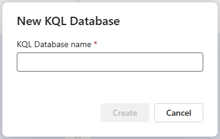
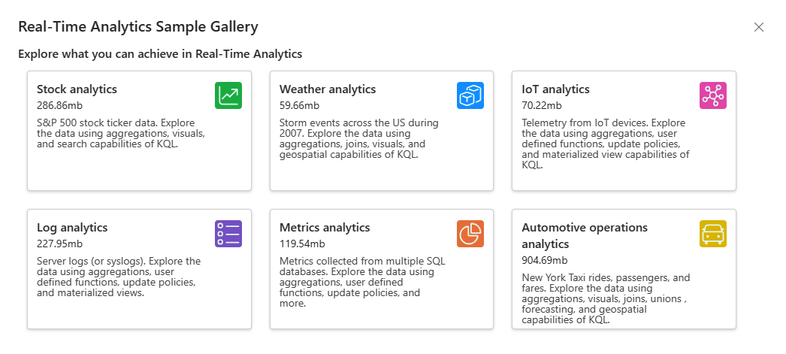
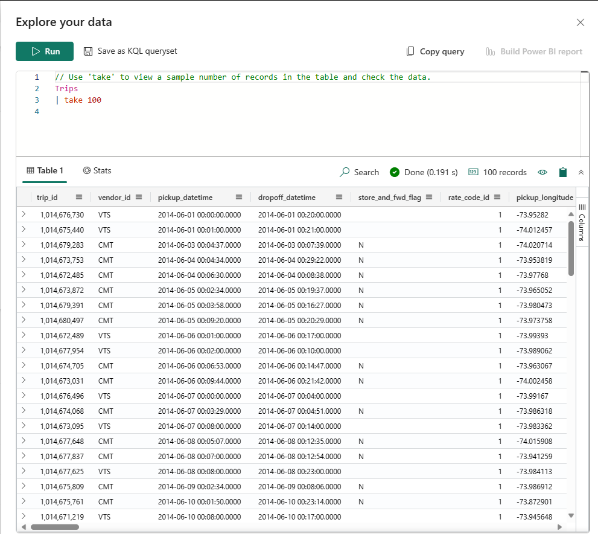
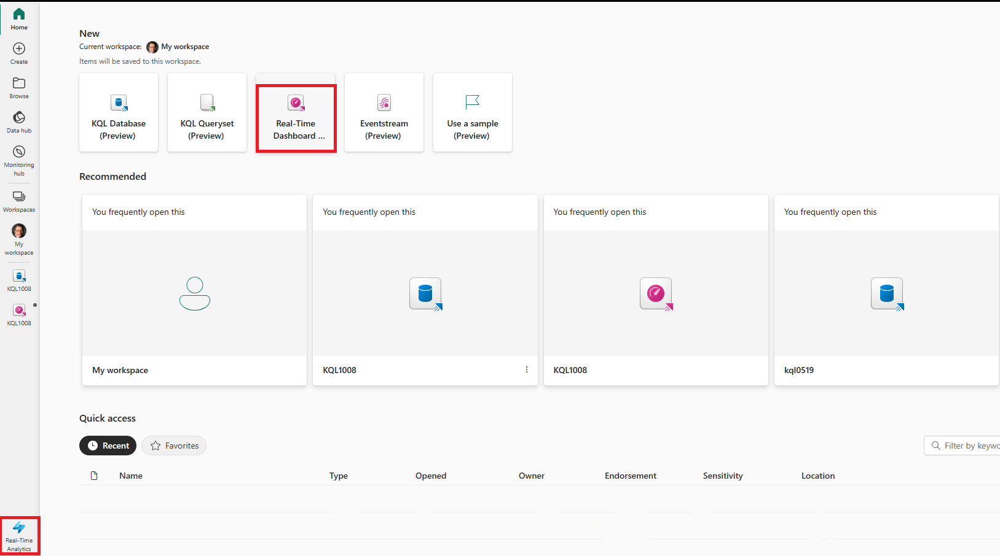

## ***BORRADOR DE TRABAJO**
---
lab:
  title: Paneles en tiempo real
  module: Query data from a Kusto Query database in Microsoft Fabric
---

# Introducción a la consulta de una base de datos de Kusto en Microsoft Fabric
Los paneles en tiempo real le permiten obtener información detallada desde Microsoft Fabric utilizando el Lenguaje de consulta de Kusto (KQL) para recuperar datos estructurados y no estructurados y representarlos en gráficos, diagramas de dispersión, tablas, etc. dentro de paneles que permiten una vinculación similar a la de las segmentaciones de Power BI. 

Este laboratorio se realiza en **25** minutos aproximadamente.

> **Nota**: Necesita una cuenta *educativa* o *profesional* de Microsoft para completar este ejercicio. Si no tiene una, puede [registrarse para una evaluación gratuita de Microsoft Office 365 E3 o superior](https://www.microsoft.com/microsoft-365/business/compare-more-office-365-for-business-plans).

## Crear un área de trabajo

Antes de trabajar con datos de Fabric, cree un área de trabajo con la evaluación gratuita de Fabric habilitada.

1. En la [página principal de Microsoft Fabric](https://app.fabric.microsoft.com), seleccione **Análisis en tiempo real**.
1. En la barra de menús de la izquierda, seleccione **Áreas de trabajo** (el icono tiene un aspecto similar a &#128455;).
1. Cree una nueva área de trabajo con el nombre que prefiera y seleccione un modo de licencia que incluya capacidad de Fabric (*Evaluación gratuita*, *Prémium* o *Fabric*).
1. Cuando se abra la nueva área de trabajo, debe estar vacía.

    

En este laboratorio, usará Análisis en tiempo real (RTA) en Fabric para crear una base de datos KQL a partir de una secuencia de eventos de muestra. Real-Time Analytics proporciona un conjunto de datos de ejemplo que puede utilizar para explorar las funcionalidades de RTA. Usará estos datos de muestra para crear consultas KQL | SQL y conjuntos de consultas que analicen datos en tiempo real y permitan otros usos en procesos posteriores.

## Creación de una base de datos KQL

1. En **Análisis en tiempo real**, seleccione la casilla **Base de datos KQL**.

   

2. Se le pide que asigne un **Nombre** a la base de datos KQL

   

3. Dele un nombre a la base de datos KQL que sea fácil de recordar, como **MyStockData**, y presione **Crear**.

4. En el panel **Detalles de la base de datos**, seleccione el icono de lápiz para activar la disponibilidad en OneLake.

   

5. Seleccione el cuadro de **datos de ejemplo** en las opciones de ***Inicio obteniendo datos***.
 
   

6. elija el cuadro **Análisis de métricas de Automoción** en las opciones de los datos de ejemplo.

   

7. Una vez que los datos terminen de cargarse, podemos comprobar que la base de datos KQL se rellena.

   

7. Una vez cargados los datos, verifíquelos en la base de datos KQL. Para realizar esta operación, seleccione los puntos suspensivos situados a la derecha de la tabla, vaya a **Consultar tabla** y seleccione **Mostrar 100 registros cualesquiera**.

    

   > **NOTA**: La primera vez que ejecute esto, puede tardar varios segundos en asignar recursos de proceso.

    


## Escenario
En este escenario, creará un panel en tiempo real basado en los datos de ejemplo que proporciona Microsoft Fabric que le permitirá mostrar datos en una variedad de métodos, crear una variable y usar esta variable para vincular los paneles del panel juntos para obtener información más detallada sobre lo que está ocurriendo en el sistema o sistemas de origen. En este módulo utilizamos el conjunto de datos de taxis de Nueva York para ver los detalles actuales de los viajes por municipio y similares.

1. Vaya a **Análisis en tiempo real** y, a continuación, seleccione **Panel en tiempo real** en la página principal de Fabric.

    

1. Presione el botón **Agregar nuevo icono** en tne.

```kusto

Trips
| summarize ["Total Trip Distance"] = sum(trip_distance) by pickup_boroname
| project Borough = case(isempty(pickup_boroname) or isnull(pickup_boroname), "Unidentified", pickup_boroname), ["Total Trip Distance"]
| sort by Borough asc 

```
3. Presione el botón Ejecutar y compruebe que la consulta no tiene errores.
4. En el lado derecho del panel, seleccione la pestaña **Aplicación de formato de objeto visual** y complete el ***Nombre del icono*** y el ***Tipo de objeto visual***.

   

